# vscode-gradle-language

## Introduction

An extension to provide Gradle language support for Visual Studio Code, including advanced functionalities like __Syntax Highlighting__, __Keyword Auto-completion Proposals__ and __Duplication Validation__.

Homepage: [Visual Studio Code Marketplace](https://marketplace.visualstudio.com/items?itemName=naco-siren.gradle-language)

## Stucture
The extension observes all `.gradle` documents and uses the server to provide validation and auto-completion proposals (IntelliSense).

The code for the _extension_ is in the `client` folder, which uses the `vscode-languageclient` node module to launch the language server.

The _language server_ is located in the `server` folder.

The _tests_ are located in the `test` folder.

## Features

### Syntax Highlighting

* The extension converts the [sublime-gradle](https://github.com/kingofmalkier/sublime-gradle)'s TextMate grammar configuration for Gradle language.

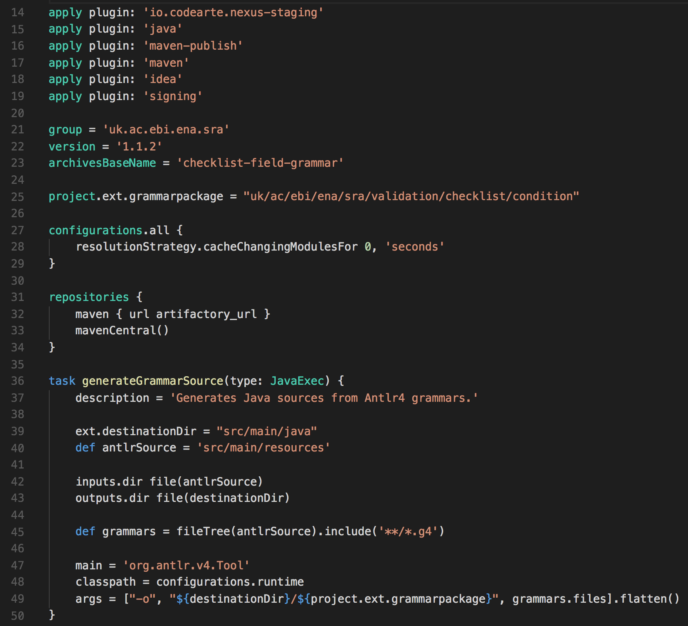

### Keyword Auto-completion Proposals (IntelliSense)

The extension automatically detects the Java and Android plugin used in the Gradle scripts, then propose keywords smartly in different situations depending on the position of the cursor:
    
* Inside a line with existing code:

    * At the start of a word:
        
        * Particularly, after the `apply` method, propose the parameters for plugin application.
        
        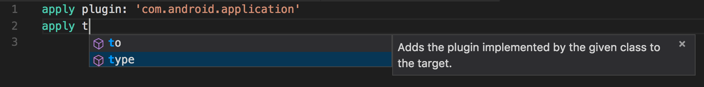

        * In a Task Container's constructor:

            * At the start of a parameter, propose Task Container's constructor parameters.
            
            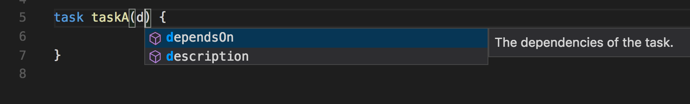

            * Particularly, after the `type` parameter, propose Task's default types.

            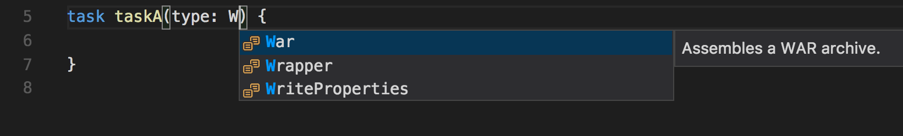

            * Particularly, after the `dependsOn` parameter, propose other Tasks names.

            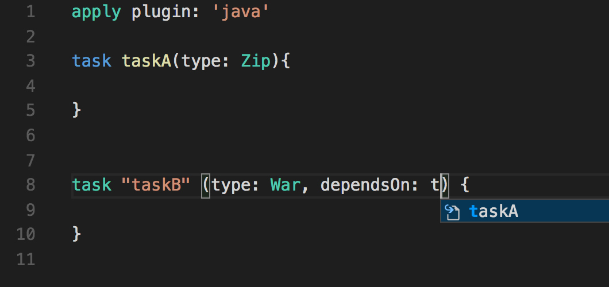

            * Particularly, after the `TaskDependency` methods (i.e. `dependsOn`, `finalizedBy`, `mustRunAfter` and `shouldRunAfter`), propose other Tasks names.

            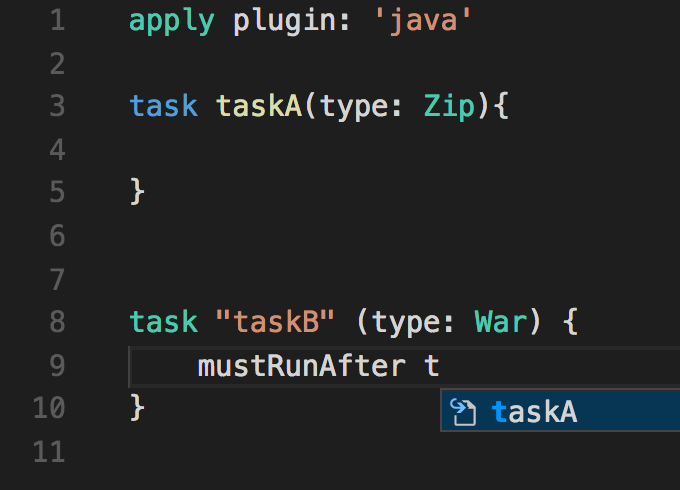

        * Elsewhere, propose the Delegate Object together with its properties and methods.
        
        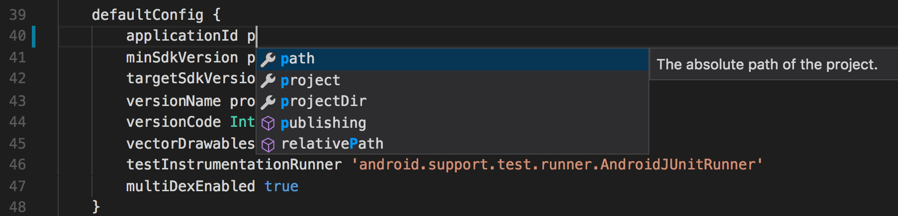

    * After an entity's dot inside a line with existing code, propose the properties and methods of this entity.
    
    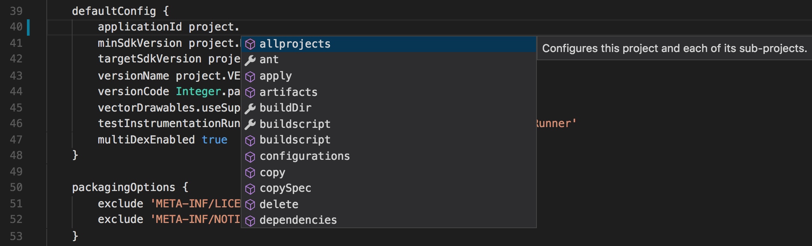

* At the start of a new line:

    * On the root level of the build script, propose the properties and methods of the current script's Delegate Object.
    
    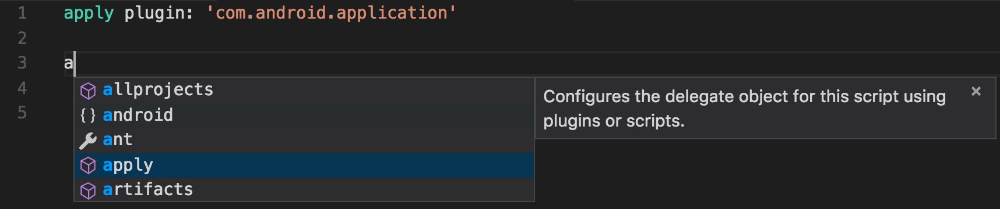

    * Particularly, in a `TaskContainer`, analyze the task's type and propose the properties and methods according to this type.
    
    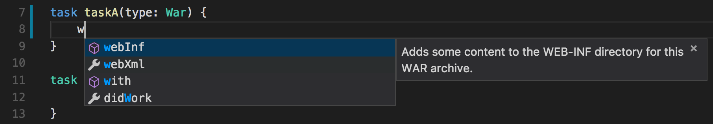

    * In a script block of `NamedDomainObjectContainer`, such as `BuildTypes`, `ProductFlavors`, `SigningConfigs` and `AndroidSourceSets`, __DO NOT__ override default keywords and let the user decide the name for each item.
    
    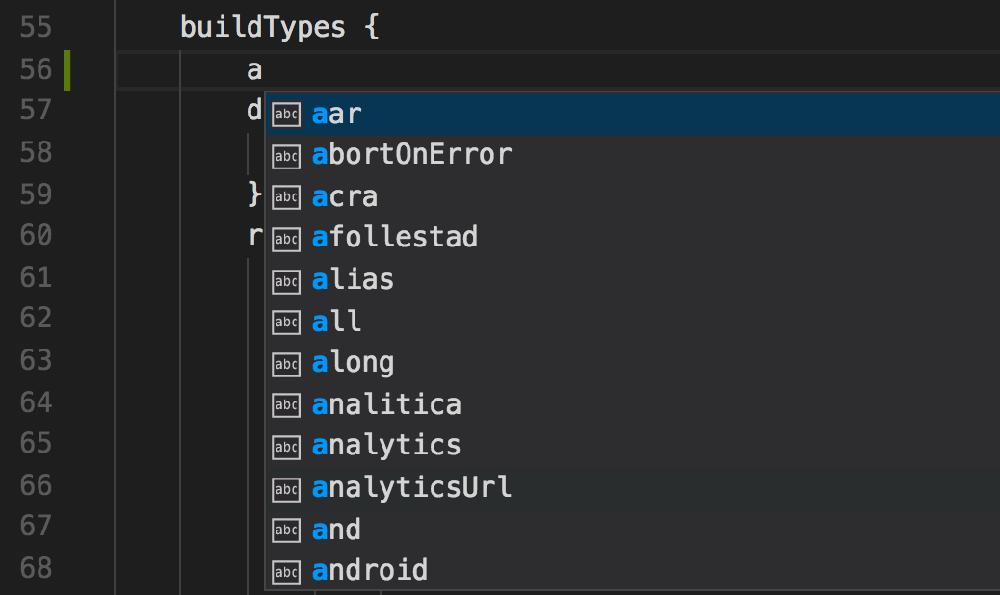

    * In a configure closure of an item within a `NamedDomainObjectContainer`, propose the properties and methods of this container's element type.
    
    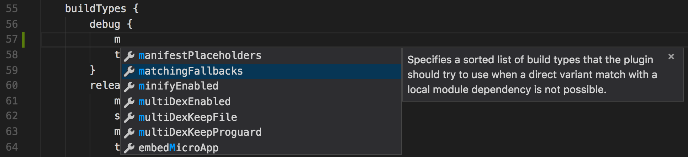

    * In a script block of a general property or method, propose the properties and methods of this script block.

    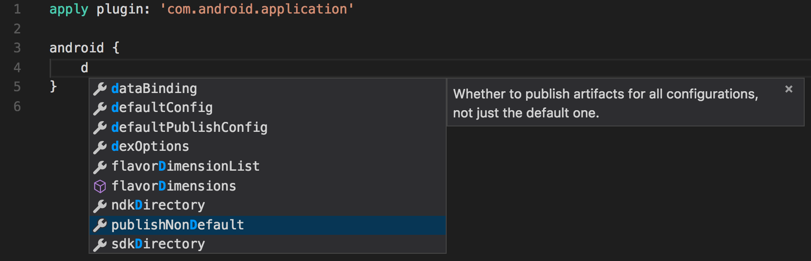
    
### Duplication Validation

* The extension automatically validates the script under editing and warns the user about duplicated script blocks.

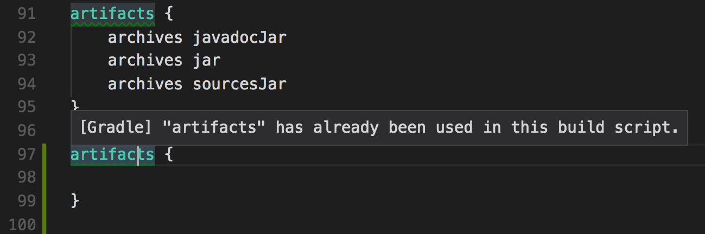

## Tutorial

### Requirements

* Download and install [Visual Studio Code](https://code.visualstudio.com/download).
* Download and install [Node.js](https://nodejs.org/zh-cn/download/).

### How to launch the extension
* Pull the repo and `cd` to the root directory.
* Run `npm install` to initialize the extension and the server.
* Run `npm run compile` in the terminal to compile the extension and the server.
* Open the root folder in Visual Studio Code, then set the `Preferences -> Color Theme` to `Dark+ (default dark)`.
* In the Debug viewlet, run `Launch Client` from drop-down menu (or press `F5`) to launch the extension and attach to the extension.
* Create and open a file `build.gradle` and type `'app'` into it. You should see keywords proposed including `'apply'`.

### How to debug the server
* In the Debug viewlet, run `Attach to Server` launch config and set breakpoints in the client or the server.

### How to run the tests
* In the Debug viewlet, run `Launch Unit Tests` from drop-down menu to run the unit tests.

## Known Issues

* Syntax highlighting doesn't always work consistently with task constructor with parameters in parentheses, i.e. `task foo(type: Bar) {...}` and `task foo {...}` 
